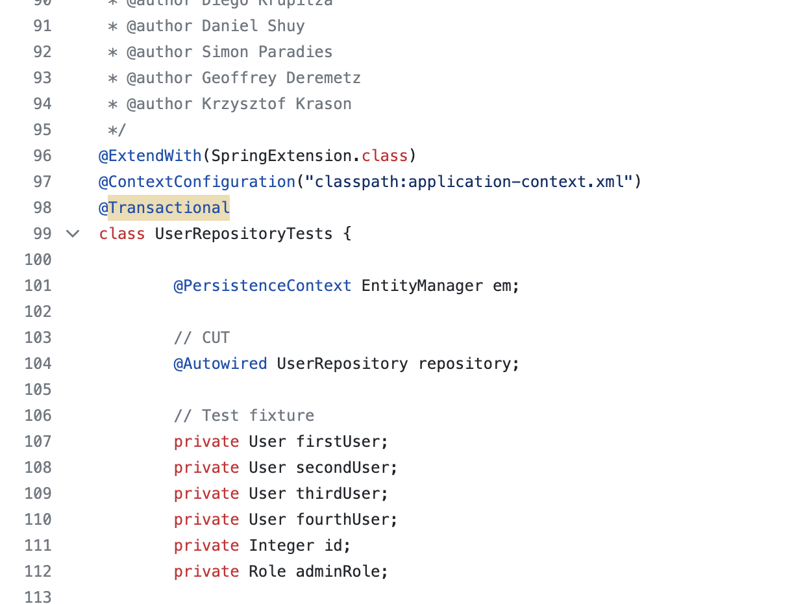

# JPA와 @Transactional 을 테스트 코드에 사용할 때 주의하기

Spring Data JPA 팀에서도 아래와 같이 `@Transactional` 을 테스트 코드에서 사용하고 있다.  

- [spring-data-jpa/UserRepositoryTests](https://github.com/spring-projects/spring-data-jpa/blob/main/spring-data-jpa/src/test/java/org/springframework/data/jpa/repository/UserRepositoryTests.java)

## 이유

### 1. 의도치 않은 트랜잭션 적용

### 2. 테스트 클래스 내부에서의 격리 실패

테스트 클래스에 트랜잭션이 잡혀서, 
테스트 클래스 내부에서는 서로 격리된 테스트가 불가능하다.

테스트 메소드마다 트랜잭션 선언해서 해결 가능
### 3. 트랜잭션 전파 속성을 조절한 메서드나 비동기 메서드 테스트 시 롤백 실패

### 4. TransactionalEventListener 동작 실패

### 5. JPA랑 같이 사용할 때 로그에 쿼리가 안보이는 현상