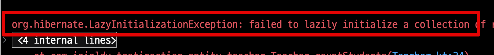
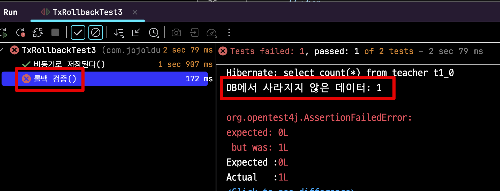
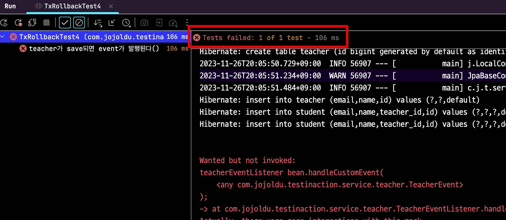

# 테스트 데이터 초기화에 @Transactional 사용하는 것에 대한 생각

얼마 전에 2개의 핫한 컨텐츠가 공유되었다.  

- [존경하는 재민님의 유튜브 - 테스트에서 @Transactional 을 사용해야 할까?](https://www.youtube.com/watch?v=PDhN6aiF7QQ)
- [존경하는 토비님의 페이스북](https://www.facebook.com/tobyilee/posts/pfbid037KmQz4TbwBfgkAXc8JjMjipMesF9iuTTWvMtUKirr3742cGfvVrq4Aft33CGmLWSl)

2개의 컨텐츠에서 테스트 데이터 초기화에 @Transactional 사용하는 것에 대해 **서로 다른 의견을 내신 것**이다. 


마침 페이스북에 태깅되기도 했고 (ㅠㅠ)  
과거에 라이브 방송에서도 "향로님은 반대한다" 라고 언급되기도 했었다.  
(반대하는 것은 사실이기도 하고..)    
  
내 생각을 정리해야지 해야지 하다가, 마침 이번주에 시간이 되어서 정리하게 되었다.  
  
## 1. Spring Team은?

내 의견을 정리하기 전에, 먼저 Spring Team 의 코드를 살펴보자.  
  
인프라스트럭쳐 계층 (데이터베이스) 테스트를 작성하는 팀의 코드를 보면 될 것 같아서 Spring Data JPA 팀의 코드를 찾아보면,  
아래와 같이 `@Transactional` 을 테스트 코드에서 사용하고 있는 것을 볼 수 있다.  


- [spring-data-jpa/UserRepositoryTests](https://github.com/spring-projects/spring-data-jpa/blob/main/spring-data-jpa/src/test/java/org/springframework/data/jpa/repository/UserRepositoryTests.java)

다른 테스트 코드들도 찾아보면 `@Transactional` 을 사용한 코드들이 꽤 있다.  
모든 테스트 코드가 `@Transactional` 을 사용하고 있는 것은 아니지만,  
그래도 스프링 팀에서도 권장하는 방법이라는 것을 알 수 있다.

## 2. 발생할 수 있는 문제점

그럼 나는 왜 반대할까?  
테스트 코드에서 `@Transactional` 을 테스트 데이터 초기화 용도로 사용할때 발생하는 문제점들을 알아보자.

> 모든 코드는 [Github](https://github.com/jojoldu/spring-boot-kotlin-test-in-action/tree/master/src/test/kotlin/com/jojoldu/testinaction/service/teacher) 에 있다.  
> kotlin 연습도 같이 할 겸 kotlin으로 모든 예제를 작성했다.

### 2-1. 의도치 않은 트랜잭션 적용

너무 유명한 사례인, "의도치 않은 트랜잭션 적용" 이 있다.  
예를 들어 아래 코드는 
- 실제 코드에서는 `@Transacational` 이 누락되어있으며
- 테스트 코드에서는 데이터 초기화를 위해 `@Transacational` 이 포함되어있다.


이럴 경우 테스트 컨텍스트에서는 트랜잭션이 있어 테스트는 통과한다.  


반면 트랜잭션이 없으니 당연하지만 **실제 실행시에는 오류가 발생**한다.  



물론 요즘의 대부분의 스프링에서의 개발은 Service 클래스에 `@Transacational(readOnly=true)` 를 기본적으로 선언해서 이렇게 ORM 에서 발생할만한 여지를 최소화하고 있다.  
  
그래서 팀의 규칙만 잘 정한다면 해당 이슈가 발생할만한 여지가 거의 없다.  
그렇지만, 실제 환경과 테스트 환경의 불일치로 정확한 테스트가 되지 않고 놓치는 부분이 발생할 수 있다는 것 역시 사실이다.

### 2-2. 트랜잭션 전파 속성을 조절한 테스트 롤백 실패

또 다른 경우로는 트랜잭션 전파 레벨을 수정해서 **새로운 트랜잭션이 필요한 경우 롤백이 되지 않는 것**이 있다.  
  
예를 들어 다음과 같이 기본 전파 레벨인 `REQUIRED` 가 아닌 `REQUIRES_NEW` 가 필요한 비즈니스 상황이 있다고 가정해보자.  

```kotlin
    @Transactional(propagation = Propagation.REQUIRES_NEW)
    fun saveAllNew (teachers: List<Teacher>) : Int {
        return teacherRepository.saveAll(teachers).size
    }
```

위 코드에 대한 테스트 코드를 작성해보자.  
다만, 데이터베이스가 정상적으로 롤백 되었는지 확인하기 위해 **다음 테스트에서 데이터베이스가 비어있는지** 확인해본다.  


```kotlin
@TestMethodOrder(
    MethodOrderer.OrderAnnotation::class)
@SpringBootTest
@Transactional
class TxRollbackTest2 {

    @Autowired
    private lateinit var teacherService: NoTxTeacherService

    @Autowired
    private lateinit var teacherRepository: TeacherRepository

    @Test
    @Order(1) // 첫번째 테스트 - 이 테스트가 끝나고 2번째 테스트에서 검증한다
    fun `여러건의 teacher와 student가 일괄 저장된다`() {
        // given
        val email = "jojoldu@gmail.com"
        val teacher1 = Teacher(name = "jojoldu", email = email)
        teacher1.addStudent(Student(name = "John", email = "John@gmail.com", teacher = teacher1))
        teacher1.addStudent(Student(name = "Jane", email = "Jane@gmail.com", teacher = teacher1))

        // when
        val result = teacherService.saveAllNew(listOf(teacher1))

        assertThat(result).isEqualTo(1)
    }

    @Test
    @Order(2) // 2번째 테스트 - 시작전에 데이터베이스가 비어있는지 검증한다.
    fun `롤백 검증`() {
        val count = teacherRepository.count()
        println("DB에서 사라지지 않은 데이터: $count")

        assertThat(count).isEqualTo(0)
    }
}
```

위 테스트 결과는 어떨까?  
2번 테스트에서 테이블이 비어있을까?  
테스트를 실행해보면, 첫번째 테스트 후 초기화가 되어있지 않다.  


당연한 얘기지만, **테스트 대상 메소드는 새로운 트랜잭션을 만드는 전파 레벨** (`REQUIRES_NEW`) 이기 때문에 해당 메소드에서 저장된 데이터는 테스트 트랜잭션과 무관하다.  
  
반대로 명시적 데이터 초기화는 정상적으로 작동한다.  
(트랜잭션과 무관하기 때문에)  

```kotlin
@TestMethodOrder(
    MethodOrderer.OrderAnnotation::class)
@SpringBootTest
class OriginalTest2 {

    @Autowired
    private lateinit var cleanUp: CleanUp

    @Autowired
    private lateinit var teacherService: NoTxTeacherService

    @Autowired
    private lateinit var teacherRepository: TeacherRepository

    @AfterEach
    fun tearDown() {
        cleanUp.all() // 명시적 데이터 초기화
    }

    @Test
    @Order(1)
    fun `여러건의 teacher와 student가 일괄 저장된다`() {
        // given
        val email = "jojoldu@gmail.com"
        val teacher1 = Teacher(name = "jojoldu", email = email)
        teacher1.addStudent(Student(name = "John", email = "John@gmail.com", teacher = teacher1))
        teacher1.addStudent(Student(name = "Jane", email = "Jane@gmail.com", teacher = teacher1))

        // when
        val result = teacherService.saveAllNew(listOf(teacher1, teacher2))

        assertThat(result).isEqualTo(1)
    }

    @Test
    @Order(2)
    fun `롤백 검증`() {
        val count = teacherRepository.count()
        println("DB에서 사라지지 않은 데이터: $count")

        assertThat(count).isEqualTo(0)
    }
}
```

테스트 결과는 성공이다.


즉, 테스트 클래스에 `@Transactional` 로 선언하면 **트랜잭션 전파 레벨에 따라 데이터 초기화가 작동되지 않는다**.  
  
이는 **해당 테스트가 끝나고 초기화 되지 않는 데이터로 인해 다른 테스트가 영향을 받을 수 있다는 것**을 의미한다.  
각 테스트간 격리가 될 수 없게 되는 것이다.

### 2-3. 비동기 메서드 테스트 롤백 실패

2번째 예제와 비슷하게 비동기 메소드에서도 동일하게 초기화가 적용되지 않는다.  
예를 들어 다음과 같이 `CompletableFuture` 기반의 비동기 메소드에서 `insert` 를 한다고 가정해보자.  
(실제로는 비동기로 `insert` 할 일이 거의 없지만)

```kotlin
    fun asyncSave(teacher: Teacher): CompletableFuture<String> {
        return CompletableFuture.supplyAsync {
            teacherRepository.save(teacher)
            Thread.sleep(500)
            teacher.email
        }
    }
```

해당 메소드의 테스트 코드를 작성하면 다음과 같다.


이 테스트 코드를 실행해보면 **비동기 메소드에 대한 테스트가 끝난 후 데이터가 초기화 되지 않았음**을 알 수 있다.  



반대로 명시적 초기화를 사용하는 테스트 코드로 변경해보고

```kotlin
@TestMethodOrder(
    MethodOrderer.OrderAnnotation::class)
@SpringBootTest // 트랜잭션 제거
class OriginalTest3 {

    @Autowired
    private lateinit var cleanUp: CleanUp

    @Autowired
    private lateinit var teacherService: NoTxTeacherService

    @Autowired
    private lateinit var teacherRepository: TeacherRepository

    // 명시적 초기화
    @AfterEach
    fun tearDown() {
        cleanUp.all()
    }

    @Test
    @Order(1)
    fun `비동기로 저장된다`() {
        // given
        val email = "jojoldu@gmail.com"
        val teacher = Teacher(name = "jojoldu", email = email)
        teacher.addStudent(Student(name = "John", email = "John@gmail.com", teacher = teacher))
        teacher.addStudent(Student(name = "Jane", email = "Jane@gmail.com", teacher = teacher))

        // when
        val futureResult = teacherService.asyncSave(teacher)
        val result = futureResult.get()

        assertThat(result).isEqualTo(email)
    }

    @Test
    @Order(2)
    fun `롤백 검증`() {
        val count = teacherRepository.count()
        println("DB에서 사라지지 않은 데이터: $count")

        assertThat(count).isEqualTo(0)
    }
}
```

위와 같이 명시적인 데이터 초기화는 역시 정상적으로 작동된다.


2번 예제와 마찬가지로 비동기 메소드에서도 역시 해당 테스트가 끝나고 초기화 되지 않는 데이터로 인해 다른 테스트가 영향을 받게 되어 각 테스트간 격리가 될 수 없다.

### 2-4. TransactionalEventListener 동작 실패

마지막 예제는 `TransactionalEventListener` 가 **정상적으로 작동되지 않는 것**이다.  
  
요즘 `TransactionalEventListener` 를 통해 Event 기반의 구현 하는 경우를 예전보다 자주 보게 된다.  
(개인적으로는 선호하는 방식은 아니지만)  

예를 들면, 다음과 같은 로직 구현이 필요하다고 가정해보자.

```kotlin
// TeacherEvent.kt
class TeacherEvent (val message: String)

// TeacherEventListener.kt
@Component
class TeacherEventListener {
    companion object {
        private val logger = LoggerFactory.getLogger(TeacherEventListener::class.java)
    }

    @TransactionalEventListener(phase = TransactionPhase.AFTER_COMMIT)
    fun handleCustomEvent(event: TeacherEvent) {
        logger.info("TeacherEvent 발행 after transaction commit: ${event.message}")
    }
}

// TeacherService.kt
class TeacherService{
  ...
    @Transactional
    fun saveAndPublish(teacher: Teacher) {
        teacherRepository.save(teacher)
        // 트랜잭션이 커밋되면 처리될 이벤트 발행
        eventPublisher.publishEvent(TeacherEvent("saved teacherEmail=${teacher.email}"))
    }
}
```

위 코드는 **트랜잭션의 커밋이 끝난 후 처리가 필요한 이벤트 발행/리스너 코드**이다.  
  
이 코드의 핵심은 `TransactionPhase.AFTER_COMMIT` 인데, 이는 **트랜잭션 커밋이 성공한 이후** 시점이다.  
  
해당 코드의 테스트 코드를 `@Transactional` 를 활용해서 작성해보면 다음과 같다.

```kotlin
@SpringBootTest
@Transactional
class TxRollbackTest4 {

    @Autowired
    private lateinit var teacherService: NoTxTeacherService

    @MockBean
    private lateinit var teacherEventListener: TeacherEventListener

    @Test
    fun `teacher가 save되면 event가 발행된다`() {
        val email = "jojoldu@gmail.com"
        val teacher = Teacher(name = "jojoldu", email = email)
        teacher.addStudent(Student(name = "John", email = "John@gmail.com", teacher = teacher))
        teacher.addStudent(Student(name = "Jane", email = "Jane@gmail.com", teacher = teacher))

        teacherService.saveAndPublish(teacher)

        // 이벤트 리스너가 호출되었는지 확인
        verify(teacherEventListener)
            .handleCustomEvent(any())
    }
}
```

- `Mockito.verify` 를 통해 리스너의 실행여부를 확인한다.

테스트를 실행해보면 다음과 같이 실행 되지 않았음을 확인할 수 있다.



당연하지만, **테스트의 트랜잭션 커밋이 끝나지 않았기 때문에** `TransactionalEventListener` 가 수행될 수가 없다.  
  
이럴때 테스트 코드에서 `@Transactional` 를 제거한다면, **서비스 코드에 있는 트랜잭션만 적용되어** 정상적으로 결과를 볼 수 있다.

```kotlin
@SpringBootTest
class OriginalTest4 {

    @Autowired
    private lateinit var teacherService: NoTxTeacherService

    @Autowired
    private lateinit var teacherRepository: TeacherRepository

    @MockBean
    private lateinit var teacherEventListener: TeacherEventListener

    @AfterEach
    fun tearDown() {
        teacherRepository.deleteAll()
    }

    @Test
    fun `teacher가 save되면 event가 발행된다`() {
        val email = "jojoldu@gmail.com"
        val teacher = Teacher(name = "jojoldu", email = email)
        teacher.addStudent(Student(name = "John", email = "John@gmail.com", teacher = teacher))
        teacher.addStudent(Student(name = "Jane", email = "Jane@gmail.com", teacher = teacher))

        teacherService.saveAndPublish(teacher)

        // 이벤트 리스너가 호출되었는지 확인
        verify(teacherEventListener)
            .handleCustomEvent(any())
    }
}
```

위 테스트 코드를 수행하면 `teacherEventListener` 가 수행되었음을 확인할 수 있다.


## 3. 마무리

요약하자면 개발자가 별도의 실수 없이 일반적인 트랜잭션 방법을 적용해서 코드를 작성했다면, 테스트에서 `@Transactionl` 을 사용하는 것에 문제가 없으나,  
**트랜잭션과 관련된 코드**에서는 테스트에서 `@Transactional` 을 사용하면 문제가 발생할 수 있다.  

- 트랜잭션 관련 기능을 정상적으로 검증/사용 못하거나
- 테스트 데이터가 초기화 되지 않거나
  
앞서 소개했던 것처럼 스프링 팀에서도 `@Transactional` 을 테스트 코드에서 사용하고 있다.  
그래서 테스트 코드에서 `@Transactional` 을 사용하는 것이 안티 패턴은 아니다.  
다만, 테스트 코드에서 `@Transactional` 을 사용할 때는 위에서 설명한 것처럼 주의가 필요하다.  

같은 이유로 `@DataJpaTest` 도 사용에 주의가 필요하다.    
내부적으로 `@Transactional` 을 선언하고 있기 때문이다.  
  
나는 **팀의 구성원 모두가 실수할 수 없을만큼 쉬운 방법들**을 팀의 Ground Rule 기준으로 둔다.  
  
AA 상황에서는 XX로 해야하고,  
BB 상황에서는 YY로 해야한다 등의 규칙을 만들면   
팀의 Ground Rule 이 복잡해지고, 제대로 이해하지 못할 수도 있다.  
그래서 최대한 간단하게, 모두가 이해할 수 있는 수준으로 설정해왔다.  
  
팀 마다 추구하는 방향성이 다르지만,  
내가 속한 팀에서는 항상 위와 같은 기준으로 **테스트 코드에서 `@Transactional` 을 사용하지 않는 것을 권장한다**.  
  
> 근데 스프링 팀도, 토비님도, 영한님도 `@Transactional` 를 테스트 데이터 초기화에 사용하는 데, 사용하는 것이 더 메인 스트림 아닌가? 하는 생각을 종종 한다.  
> 그래서 이 글은 나중에 다시 한번 쓰게 될지도 모른다.

## 번외 - 테스트 데이터 초기화

테스트 데이터 초기화를 위해 `@Transactional` 을 사용하지 않는다면, 그럼 어떻게 하나?  
매번 테스트에 사용된 테이블들을 하나씩 찾아보면서 초기화해야하는 것인가?  
  
개인적으로는 명시적 초기화 하는 메소드를 선언해서 사용하는 것을 권장한다.  
  
이걸 구현하는 것은 크게 어렵지는 않다.  
아래와 같은 조건에서는 말이다.

- **모든 테이블간에 FK 제약 조건을 사용하지 않는다**.
  - 제약 조건이 있으면 테이블의 크기가 커질수록 Online DDL 등을 사용하기 어려워 테이블 변경이 어렵다.
- 테이블 간의 관계를 애플리케이션에서 관리한다.
- 데이터에 대한 접근은 ORM 등의 계층에서 일원화한다.

항상 개발할때 이런 환경을 구축하고 있어서, **테스트 데이터 초기화는 굉장히 쉽다**.  
JPA로 관리되는 모든 Entity들의 연관 테이블을 `truncate` 하면 되기 때문이다.  
  
테스트 패키지에 다음과 같이 테스트에서만 사용할 `Bean` 을 하나 만들어두고
```kotlin
@Component
class CleanUp(
    private var jdbcTemplate: JdbcTemplate,
    private var entityManager: EntityManager
) {

    @Transactional
    fun all() {
        val tables = entityManager.metamodel.entities.map { it.name }

        tables.forEach { table ->
            jdbcTemplate.execute("TRUNCATE table $table")
        }
    }
}
```

이를 다른 테스트 코드의 `afterEach` 에서 사용한다.
```kotlin
@SpringBootTest
class XxTest {

    @Autowired
    private lateinit var cleanUp: CleanUp

    @AfterEach
    fun tearDown() {
        cleanUp.all()
    }
    ...
```

물론 위 `truncate` 는 서로 간섭하지 않기 때문에 테이블이 많다면 병렬로 수행해도 무방하다.  
  
만약 매번 많은 테이블에 그런 전체 초기화 하는 것이 부담스럽다면 필요한 Entity들만 초기화하면 된다.  

